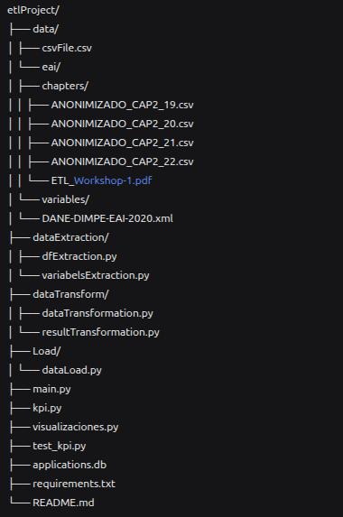
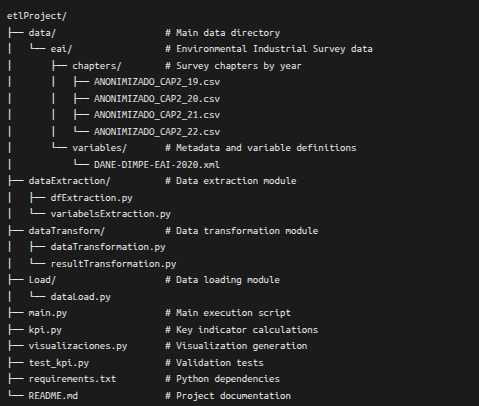

# ETL Project: Analysis of Environmental Investments in the Colombian Manufacturing Industry

## 📌 Project Description
This ETL (Extract, Transform, Load) project processes data from the Environmental Industrial Survey (EAI) of DANE to analyze investments and expenses in environmental protection made by the Colombian manufacturing industry between 2019-2022. The system generates insights on tax discounts, energy efficiency, and environmental investment returns.

## 🏗️ Project Structure




## 🔧 Technologies Used
- **Python 3.12+**
- **Pandas** - Data manipulation
- **SQLite** - Dimensional database
- **Dash** - Interactive visualizations
- **BeautifulSoup (bs4)** - XML parsing
- **ETL Framework** - Complete extraction, transformation, and loading process

## 📊 Database Schema
### Dimension Tables
```sql
CREATE TABLE DimEmpresa (
    id_fuente REAL PRIMARY KEY
)
CREATE TABLE DimRegion (
    region TEXT PRIMARY KEY
)
CREATE TABLE DimAño (
    año INTEGER PRIMARY KEY
)
CREATE TABLE DimTipoInversion (
    tipo_inversion TEXT PRIMARY KEY
)
```

### Fact Table

```sql

CREATE TABLE FactInversiones (
    id_fuente INTEGER,
    region TEXT,
    año INTEGER,
    FNCE,
    GEE_final,
    Descuento_FNCE,
    Descuento_GEE,
    suma_EFA,
    suma_GEE,
    tipo_inversion TEXT,
    porcentaje_inversion,
    Sugerencia
)

```

# 🚀 Installation and Usage


## 1. Set up virtual environment
python -m venv .venvEtl
source .venvEtl/bin/activate  # Linux/Mac
.venvEtl\Scripts\activate  # Windows

## 2. Install dependencies
pip install -r requirements.txt

## 3. Run complete ETL pipeline and visualizations
python main.py

## 4. Run validation tests
python test_kpi.py

# Expected File and Directory Structure



Note: __pycache__ directories and .db files are automatically generated during execution and do not need to be included manually.

## 📋 Requisitos del sistema:
- Python 3.12 o superior
- 8GB RAM recomendados
- 2GB espacio libre en disco
- Conexión a internet para instalación de paquetes

## 📋 System Requirements:
- Python 3.12 or higher
- 8GB RAM recommended
- 2GB free disk space
- Internet connection for package installation

## 📋 ETL Process
### 🔍 Extraction (Extract)
- **Data sources**: 4 datasets from the Environmental Industrial Survey (EAI) of DANE (2019-2022)
- **Initial volume**: 2940 columns per dataset
- **Strategic selection**: 148 relevant variables from Chapter 2
- **Metadata**: XML file parsing for variable structure
- **Processed years**: 2019, 2020, 2021, 2022

### 🔄 Transformation (Transform)
- **Data validation**: Verification of reported business calculations
- **Inconsistency detection**: Identification of erroneous or incomplete reports
- **Temporal normalization**: Unification of date formats and periods
- **Metric calculations**:
  - Energy efficiency (GEE_final)
  - Tax discounts (Descuento_FNCE, Descuento_GEE)
  - Environmental investment percentages
- **Estimations**: Projection of applicable tax discounts

### 📤 Loading (Load)
- **Database model**: Dimensional schema in SQLite
- **Created tables**:
  - 4 dimension tables (DimEmpresa, DimRegion, DimAño, DimTipoInversion)
  - 1 fact table (FactInversiones)
- **Optimization**: Indexes and relationships for efficient queries
- **Final output**: Structured data for analysis and reporting

### 📊 Pipeline Flow
1. **Initial extraction** → Raw data from CSV files
2. **Basic cleaning** → Removal of duplicates and null values
3. **Specific transformation** → Environmental metric calculations
4. **Final validation** → Data quality control
5. **Database loading** → Storage in dimensional model
6. **Report generation** → Automated reports by company

### ⚙️ Transformation Tools
- **Pandas**: Advanced data manipulation
- **Custom functions**: Domain-specific environmental calculations
- **Cross-validations**: Consistency between years and variables
- **Estimation algorithms**: Projection of tax benefits

### 🎯 Process Outputs
- **SQLite database** with optimized schema
- **Consolidated dataset** ready for analysis
- **Calculated metrics** for each company
- **Automated suggestions** for environmental investment
- **Data quality report** with quality indicators